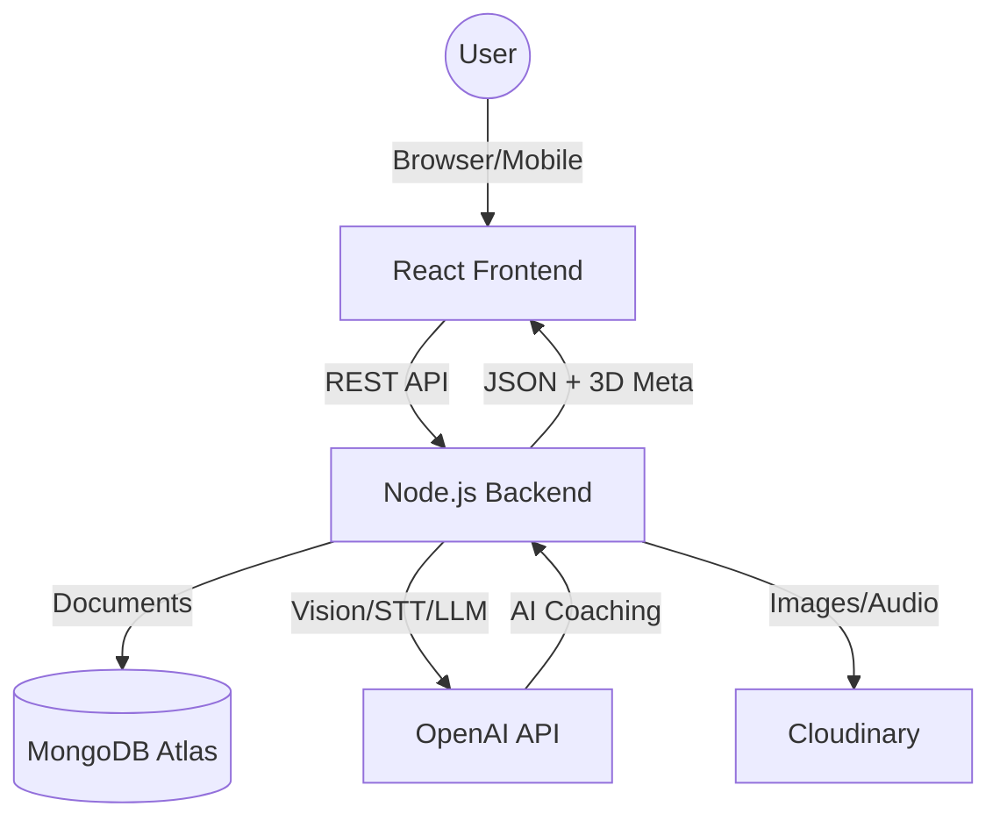

# Implementation Plan: AI-Powered Gym Tracking App

This document outlines the full-stack architecture, database schema, API design, and development roadmap for "FlexAI," a production-ready gym and nutrition tracking application.

## 1. System Architecture

### High-Level Overview
The application follows a standard **Client-Server-Database** architecture with an integrated **AI Service Layer**.

*   **Frontend**: React (Vite) + Tailwind CSS + shadcn/ui + Three.js.
*   **Backend**: Node.js (Express) REST API.
*   **Database**: MongoDB (Flexible storage for hierarchical workout/meal data).
*   **AI Service**: OpenAI (GPT-4o for vision/chat, Whisper for audio).
*   **Storage**: Cloudinary/S3 for meal images and audio blobs.

---

## 2. Feature Breakdown

### Module 1: Auth & User Management
*   JWT-based Registration/Login.
*   User Profiles (Height, Weight, Age, Activity Level, Goals).

### Module 2: Workout Tracking
*   Exercise Database (Pre-filled list + custom exercises).
*   Workout Logger (Sets, Reps, Weight, Rest Timers).
*   History View (Calendar/List).

### Module 3: Nutrition Tracking
*   Manual Entry (Search for food).
*   **AI Vision Log**: Upload photo -> Get macros.
*   Daily Calorie/Macro Progress Bars.

### Module 4: 3D Visualization & Analytics
*   **3D Muscle Map**: Interactive 3D model in workout logger to highlight targeted muscles (using Three.js).
*   **Advanced Graphs**: Progress tracking (Weight, Volume, Caloric Deficit/Surplus/Micros) on the Dashboard using Recharts.

### Module 5: AI Coach Chatbot
*   **Multimodal Chat**: Text + Audio interaction for real-time fitness advice.
*   **Voice Processing**: Whisper API for transcribing audio notes and logging.
*   **Contextual Advice**: AI evaluates meal micros/macros and workout history.

---

## 3. Database Design (MongoDB)

### Collections Structure
*   **Users**: Profile, preferences, auth.
*   **Workouts**: Daily exercise logs (Nested arrays for Sets/Exercises for performance).
*   **Meals**: Food logs, macros (including micros: Zinc, Iron, Vitamins), and image metadata.
*   **AudioNotes**: References to stored .wav/.mp3 files and their transcriptions.

---

## 4. API Design (Updated)

| Endpoint | Method | Description |
| :--- | :--- | :--- |
| `/chat/message` | POST | Send text message to AI Coach |
| `/chat/audio` | POST | Send audio note (blob) -> Transcribe -> AI Response |
| `/3d/muscles` | GET | Fetch metadata/assets for 3D muscle models |

---

## 5. AI Integration Plan

### A. AI Chatbot (Multimodal)
1.  **Audio Flow**: User records audio -> Backend sends to **OpenAI Whisper** -> Text received -> Sent to GPT-4o with User's Context (Workouts/Meals) -> AI Response (Text + optional TTS).
2.  **Context Injection**: Every chat prompt includes a "Summary" of the user's current day stats (Calories, Exercises done).

### B. 3D Model Integration
1.  **Tech**: Use `@react-three/fiber` and `@react-three/drei`.
2.  **Interaction**: When an exercise (e.g., Bench Press) is selected, the 3D model highlights the Pectorals and Triceps in a heatmap style.

---

## 6. Development Roadmap (6 Weeks)

### **Week 1: Foundation**
*   Setup Project (Vite + Express).
*   MongoDB Connection & Mongoose Models.
*   JWT Authentication (Login/Register).
*   Basic Dashboard Shell.

### **Week 2: Tracking Core**
*   Build Workout Logger (Form with dynamic rows for sets).
*   CRUD operations for Exercises.
*   Basic Diet Logging (Manual entry).

### **Week 3: AI Meal Integration**
*   Setup OpenAI API client.
*   Build Image Upload component.
*   Implementation of "Snap & Log" food feature.
*   Cloudinary integration for image storage.

### **Week 4: 3D Models & Visualization**
*   Setup React Three Fiber.
*   Integrate 3D Human Anatomy model.
*   Implement Dynamic Muscle Highlighting based on Exercise selection.
*   Build comprehensive Chart Dashboard (Daily Macro split, volume trends).

### **Week 5: AI Multimodal Chatbot**
*   Setup Chat UI with auto-scrolling.
*   Integrate Whisper API for Audio uploads.
*   Implement context-aware AI coaching (RAG lite - fetching current user data for GPT).

### **Week 6: Polish & Deployment**
*   Responsive UI adjustments.
*   Dark Mode styling.
*   Deployment to Vercel (Frontend) and Render/Heroku (Backend).

---

## 7. UI/UX Structure

### Main Screens
1.  **Home/Dashboard**: Summary cards (Steps, Calories, Next Workout).
2.  **Workout View**: Active timer + exercise list + weight inputs.
3.  **Nutrition View**: Daily intake donut chart + meal timeline.
4.  **Analytics**: Multi-tab view for Weight, Strength, and AI Reports.

---

## 8. Advanced Features (Bonus)
*   **Voice Tracking**: "Log 3 sets of bench press at 100kg" using Whisper API.
*   **Social Feed**: Share progress with friends.
*   **Wearable Sync**: Integration with Apple Health/Google Fit API.

---

## 9. Deployment Plan

*   **Frontend**: Vercel (Auto-deploy on git push).
*   **Backend**: Render or DigitalOcean App Platform.
*   **Database**: MongoDB Atlas (Cloud Database).
*   **Security**: Use `helmet`, `cors`, and environment variables for API keys.

---
## 10. Bonus Improvements (Startup-Level)

*   **Offline Support**: Use Service Workers to allow logging workouts in basement gyms with no signal.
*   **Gamification**: Badges for "First 100kg Bench" or "30 Day Streak".
*   **Barcode Scanner**: Integration with OpenFoodFacts for precise packing info.

## User Review Required

> [!IMPORTANT]
> Choose between **Node.js** and **PHP** for the backend. Node.js is recommended for easier AI API integration (using common NPM libraries).

> [!WARNING]
> Cost of OpenAI API: Food image analysis uses tokens. To minimize costs, we should compress images before sending them to the AI.

---

## Open Questions

1.  Do you have an OpenAI API Key ready, or should we use a placeholder/mock?
2.  Should we include a "Social" aspect (friends/leaderboard) now or as a future update?
3.  Do you prefer a "Mobile First" approach (PWA) or a standard Desktop Dashboard?
